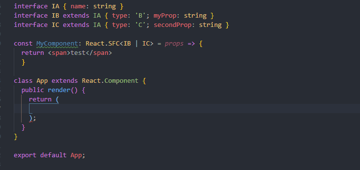

# Why typescript



[Typescript](https://www.typescriptlang.org) brings lots and lots of advantages. Errors can be caught early in the development process by the types in react. This avoids a lot of errors. Another good reason for using typescript is the developer experience it brings. By using typescript in your project you can get better code completion and write faster and more bug free code.


# Initial setup using vite

[Vite](https://vitejs.dev) is a frontend tooling suite that is lightning fast and has rich features. The startup time of the development server is in most cases under a second even for huge projects. This is achieved by using  native ESM modules.

Vite provides a template to setup a react typescript project. This is done via the following commands

* `npm init vite@latest my-project --template react-ts`
* `cd my-project`
* `npm install`

Where as `my-project` can be the name of the project you are trying to create.

The development server can be run using `npm run dev`


# Installing ESLint

[ESLint](https://eslint.org) statically analyzes your code to find problems quickly. ESLint is integrated with most text editors and you can run ESLint as part of your continuous integration pipeline.

Vite already comes with an ESLint config. You could keep using this config, but for the propose of this blog post I will show you how you can install it by your self.

First remove all prior configs. These can be a `.eslintrc.js` or `.eslintrc.json` file. The config for ESLint can also be inside the `package.json` file.

Next use `npm install eslint --save-dev` to install ESLint as a dev dependency in your project. Afterwards run `npx eslint --init` to initialise the ESLint-Config. You can follow the command line and select which options are right for you.


# Installing Prettier

[Prettier](https://prettier.io) is an opinionated code formatter. With this all your code style in your project can be unified. This saves time, energy and your code becomes easier to read and understand.

First of all you need to add Prettier as a dev dependency by using `npm install --save-dev --save-exact prettier`. Afterwards create an empty config file by runnung `echo {}> .prettierrc.json` or create it manually.

Then you can configure Prettier. All of the config options can be found [here](https://prettier.io/docs/en/options.html). For now we are using a pretty standard config:

```json
{
 "trailingComma": "es5",
 "tabWidth": 2,
 "semi": false,
 "singleQuote": true
}
```

After prettier is configured you can run `npx prettier --write .` to format all files in the current directory.