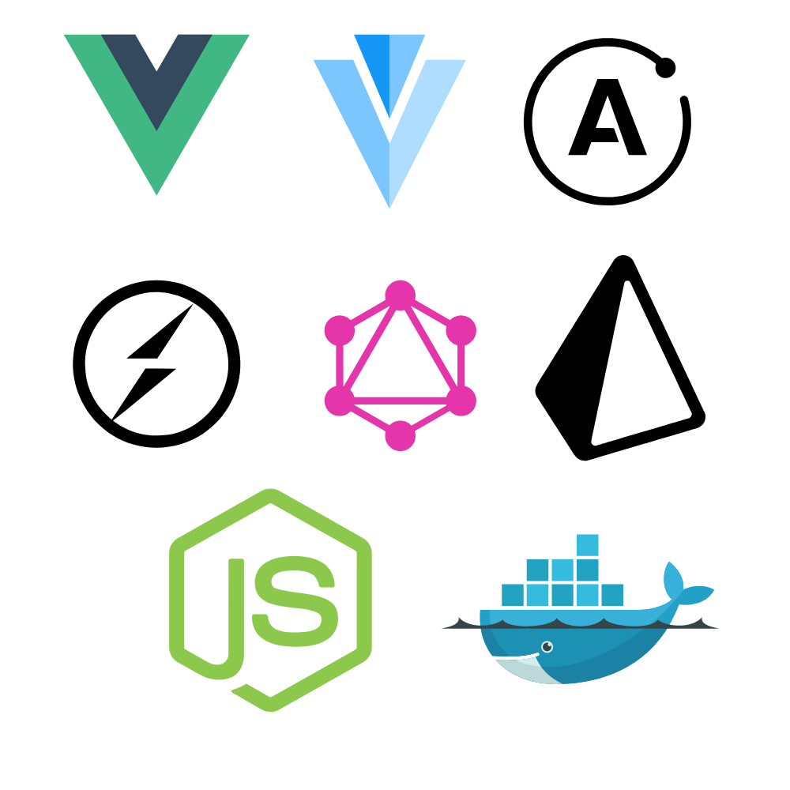
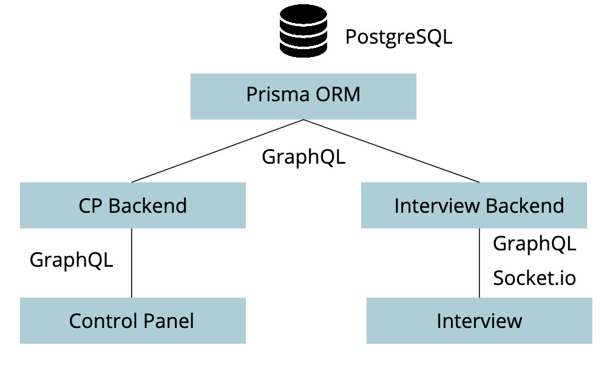

This project was started as a university project where the goal was
to create a small chat bot, who could initally screen candidates for
a job position.

You can checkout the control panel [here](https://chartr.daniel-stefan.dev/)
or try an interview [here](https://interview.chartr.daniel-stefan.dev/#/interview/ck7gm07dj00oo0757fcdrz1aq).

You can see the sources on Github:

* [Contol Panel Frontend](https://github.com/DanielStefanK/chartr.me-cp-frontend)
* [Contol Panel Backend](https://github.com/DanielStefanK/chartr.me-cp-backend)
* [Interview Frontend](https://github.com/DanielStefanK/chartr.me-interview-frontend)
* [Interview Backend](https://github.com/DanielStefanK/chartr.me-interview-backend)

# Technology used

As frontend technology we used a client site rendered Vue app with the
component library vuetify. This was choosen since I am already familiar
with Vue and the basic framework is simple enough so that other
team members could learn something new in the short amount of time that
we had. Since I did not want to design every component myself I choose
the component library vuetify. This enabled a fast development in the
frontend.

For the communication with the server graphQL was choosen.
This choice was simply made out of curiosity. I heard many things
it and wanted to try it myself on a real project.
To simplify the development I choose apollo as the frontend
graphQL client.

Since we wanted to implement a chatbot where the questions are calculated
on the server and send back to the client in real time, we choose socket.io
as a solution for that problem.

On the server side we used a node server that was running apollo server.
This was working beautifully with our apollo client in the frontend.

As the database we used prisma. This is a ORM with a graphQL API.

# Architecture

Sice we did not expect a lot of people creating Interviews but a lot of
people taking thos interviews we wanted a way to scale both of the
parts of our app differently.
This is why we have two backends. One for managing the interviews and
users and one for taking the interviews. The architecture is show in
this diagram:

